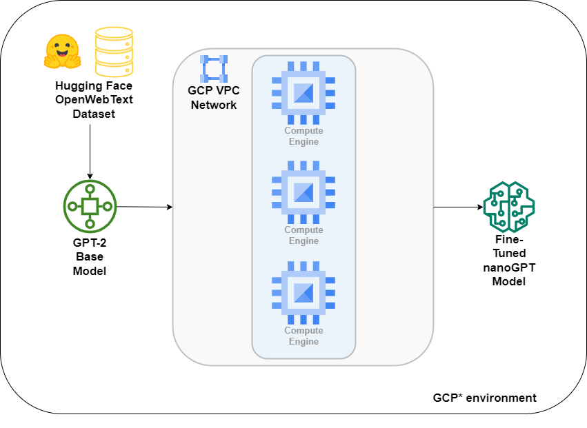

<p align="center">
  
</p>

# Intel® Optimized Cloud Modules for GCP: nanoGPT Distributed Training

The Intel Optimized Cloud Modules for Google Cloud Platform (GCP) are a set of open source cloud-native reference architectures to facilitate building and deploying optimized, efficient, and scalable AI solutions on GCP. Here is the reference architecture for this module:
<p align="center">
  
</p>


## Table of Contents
- [I. Introduction](#i-introduction)
- [II. Spinning up an instance with Google Compute Engine](#ii-spinning-up-an-instance-with-google-compute-engine)
- [III. Environment Setup](#iii-environment-setup)
- [IV. Download dataset and Fine-tune nanoGPT on a Single CPU](#iv-download-dataset-and-fine-tune-nanogpt-on-a-single-cpu)
- [V. Prepare for Distributed Fine-Tuning](#v-prepare-for-distributed-fine-tuning)
- [VI. Distributed Training](#vi-distributed-training)
- [VII. Model Inference](#vii-model-inference)
- [VIII. Clean Up Resources](#viii-clean-up-resources)
- [IX. Summary](#ix-summary)
- [X. Next Steps](#x-next-steps)

## I. Introduction
LLMs (Large Language Models) are becoming ubiquitous, but in many cases, you don't need the full capability of the latest GPT model. Additionally, when you have a specific task at hand, the performance of the biggest GPT model might not be optimal. Often, fine-tuning a small LLM on your dataset is sufficient. 

In this guide, you will learn how to fine-tune [nanoGPT](https://huggingface.co/gpt2) (124M parameter) model on a cluster of CPUs on GCP. The model is trained on [OpenWebText](https://huggingface.co/datasets/Skylion007/openwebtext) dataset in a distributed setting, using 4th Gen. Intel® Xeon® Scalable CPUs. The project builds upon the initial codebase of [nanoGPT](https://github.com/karpathy/nanoGPT), by Andrej Karpathy. The objective here is not to arrive at a chatGPT-like AI model, but rather to understand how to set up distributed training so that you can fine-tune to your specific objective. The end result of training here will result in a base LLM that can generate words, or tokens, but it will only be suitable for your use-case when you fine-tune it on your specific task and dataset.

This module demonstrates how to transform a standard single-node PyTorch training scenario into a high-performance distributed training scenario across multiple CPUs. To fully capitalize on Intel hardware and further optimize the fine-tuning process, this module integrates the [Intel® Extension for PyTorch*](https://intel.github.io/intel-extension-for-pytorch/) and [Intel® oneAPI Collective Communications Library (oneCCL)](https://www.intel.com/content/www/us/en/developer/tools/oneapi/oneccl.html). The module serves as a guide to setting up a GCP cluster for distributed training workloads while showcasing a project for fine-tuning LLMs.

[Back to Table of Contents](#table-of-contents)
## II. Spinning up an instance with Google Compute Engine

In order to get the full benefit of the best deep learning training on a CPU as possible, you can spin up 4th Gen Intel® Xeon Scalable Processors, which includes the [Intel® Advanced Matrix Extensions (AMX)](https://www.intel.com/content/www/us/en/products/docs/accelerator-engines/advanced-matrix-extensions/overview.html). On GCP, the 4th Gen Xeon is labeled as "C3" ([see GCP C3 specifications here](https://cloud.google.com/compute/docs/general-purpose-machines#c3_machine_types)). During the distributed training portion, you can spin up 3x "c3-highmem-8" virtual machines, which each have 8 vCPUs (4 physical cores), and 64 GB of memory. There are a couple of options to spin up virtual machines:

A. Spin up using Terraform scripts. [See Intel's reference solution here.](https://github.com/intel/terraform-intel-gcp-vm/tree/main/examples/gcp-linux-vm)

<details open>
  <summary>
   B. Spin up your nodes with the Google Cloud Console. I detail this in the collapsed section here.
  </summary>
</n>
You can spin up the initial instance from the Google Cloud Console, under "Compute Engine" by selecting the appropriate options, and get the equivalent commands for the Google Cloud Shell with an equivalent `gcloud` command. The options I selected in my case are shown in the screenshots here. 


And under the Boot disk option, select "Change" and the following operating system and 250 GB of storage:


Here is the equivalent code for my setup. **Please note that you can't just copy paste this without modification, as it has my specific instance name, project, zone, and service account tied to it.** You can obtain the equivalent code by selecting the options in the screenshots above and then clicking on "Equivalent code" in the top right corner of the Google Console, or replacing the options manually.

```bash
gcloud compute instances create instance-2 \
    --project=aice-12118968 \
    --zone=us-central1-a \
    --machine-type=c3-highmem-8 \
    --network-interface=network-tier=PREMIUM,nic-type=GVNIC,stack-type=IPV4_ONLY,subnet=default \
    --maintenance-policy=MIGRATE \
    --provisioning-model=STANDARD \
    --service-account=426451942867-compute@developer.gserviceaccount.com \
    --scopes=https://www.googleapis.com/auth/devstorage.read_only,https://www.googleapis.com/auth/logging.write,https://www.googleapis.com/auth/monitoring.write,https://www.googleapis.com/auth/servicecontrol,https://www.googleapis.com/auth/service.management.readonly,https://www.googleapis.com/auth/trace.append \
    --min-cpu-platform=Intel\ \
Sapphire\ Rapids \
    --create-disk=auto-delete=yes,boot=yes,device-name=instance-2,image=projects/ubuntu-os-cloud/global/images/ubuntu-2204-jammy-v20230727,mode=rw,size=250,type=projects/aice-12118968/zones/us-central1-a/diskTypes/pd-balanced \
    --no-shielded-secure-boot \
    --shielded-vtpm \
    --shielded-integrity-monitoring \
    --labels=goog-ec-src=vm_add-gcloud \
    --reservation-affinity=any
```
</details>


[Back to Table of Contents](#table-of-contents)
## III. Environment Setup

Open up a terminal window on your GCP Virtual Machine to set up the environment for fine-tuning the nanoGPT model.

We will first update the package manager and install [tcmalloc](https://github.com/google/tcmalloc) for extra performance.

```bash
sudo apt update
sudo apt install libgoogle-perftools-dev -y
```
Now let's set up a conda environment for fine-tuning GPT. First, download and install conda based on your operating system. For miniconda, You can find the most updated download instructions [here](https://docs.anaconda.com/free/miniconda/). The commands for Linux should look like:

```bash
mkdir -p ~/miniconda3
wget https://repo.anaconda.com/miniconda/Miniconda3-latest-Linux-x86_64.sh -O ~/miniconda3/miniconda.sh
bash ~/miniconda3/miniconda.sh -b -u -p ~/miniconda3
rm -rf ~/miniconda3/miniconda.sh
```

After installing, initialize the bash environment with:
```bash
~/miniconda3/bin/conda init bash
```

Once conda is installed, you can create a virtual environment and activate it:

```bash
conda create -n cluster_env python=3.11
conda activate cluster_env
```
Now we can install the Python packages in our new conda environment.

```bash
git clone https://github.com/intel/intel-cloud-optimizations-gcp
cd intel-cloud-optimizations-gcp/distributed-training/nlp
pip install -r requirements.txt
```

In order to run distributed training, we will use the [Intel® oneAPI Collective Communications Library (oneCCL)](https://github.com/intel/torch-ccl). Install oneCCL with the following command:

```bash
python -m pip install oneccl_bind_pt==2.2.0 -f https://developer.intel.com/ipex-whl-stable-cpu
```

[Back to Table of Contents](#table-of-contents)
## IV. Download dataset and Fine-tune nanoGPT on a Single CPU

Make sure you are in the `~/intel-cloud-optimizations-gcp/distributed-training/nlp` folder first. Next, we can download and prepare the full OpenWebText dataset.  This is all accomplished with one script.

```bash
python data/openwebtext/prepare.py --full
```

The complete dataset takes up approximately 54GB in the Hugging Face `.cache` directory and contains about 8 million documents (8,013,769). During the tokenization process, the storage usage might increase to around 120GB. The entire process can take anywhere from 30 minutes to 3 hours, depending on your CPU's performance.

Upon successful completion of the script, two data files will be generated:

1. `train.bin`: This file will be approximately 17GB (~9B tokens) in size.
2. `val.bin`: This file will be around 8.5MB (~4M tokens) in size.

To streamline the training process, we will use the [Hugging Face Accelerate library](https://huggingface.co/docs/accelerate/index). We can generate the training configuration file by running the following accelerate command:

```bash
accelerate config --config_file ./single_config.yaml
```

When you run the above command, you will be prompted to answer a series of questions to configure the training process. Here's a step-by-step guide on how to proceed:

First, select `This machine` as we are not using Amazon SageMaker.
```bash
In which compute environment are you running?
Please select a choice using the arrow or number keys, and selecting with enter
 ➔  This machine
    AWS (Amazon SageMaker)
```

Next, since we are initially running the script on a single machine, select `No distributed training`. 

```bash
Which type of machine are you using?                                                                                
Please select a choice using the arrow or number keys, and selecting with enter
 ➔  No distributed training
    multi-CPU
    multi-XPU
    multi-GPU
    multi-NPU
    TPU
```

You will be prompted to answer a few yes/no questions.  Here are the prompts and answers:
```bash
Do you want to run your training on CPU only (even if a GPU / Apple Silicon / Ascend NPU device is available)? [yes/NO]:yes                                                                                                             
Do you want to use Intel PyTorch Extension (IPEX) to speed up training on CPU? [yes/NO]:yes                         
Do you wish to optimize your script with torch dynamo?[yes/NO]:NO                                                   
Do you want to use DeepSpeed? [yes/NO]: NO 
```

At the very end, you will be asked to select mixed precision. Select `bf16` on 4th Generation Intel Xeon CPUs; otherwise, you can select `fp16`.

```bash
Do you wish to use FP16 or BF16 (mixed precision)?
Please select a choice using the arrow or number keys, and selecting with enter
    no   
    fp16
 ➔ bf16
    fp8
```

This will generate a configuration file and save it as `single_config.yaml` in the current working directory.

We are now ready to start fine-tuning the nanoGPT model. To start the finetuning process, you can run the [`main.py`](main.py) script. But instead of running it directly, you can use the `accelerate launch` command along with the generated configuration file because `accelerate` automatically selects the appropriate number of cores, device, and mixed precision settings based on the configuration file, streamlining the process and optimizing performance. You can begin training at this point with:

```bash
accelerate launch --config_file ./single_config.yaml main.py
```

This command will initiate the fine-tuning process.

> **Note**: By default, [`main.py`](main.py) uses the [`intel_nano_gpt_train_cfg.yaml`](intel_nano_gpt_train_cfg.yaml) training configuration file: 

```yaml
data_dir: ./data/openwebtext

block_size: 1024
  
optimizer_config:
  learning_rate: 6e-4
  weight_decay: 1e-1
  beta1: 0.9
  beta2: 0.95

trainer_config:
  device: cpu
  mixed_precision: bf16          # fp16 or bf16
  eval_interval: 5               # how frequently to perform evaluation
  log_interval: 1                # how frequently to print logs
  eval_iters: 2                  # how many iterations to perform during evaluation
  eval_only: False
  batch_size: 32
  max_iters: 10                  # total iterations
  model_path: ckpt.pt 
  snapshot_path: snapshot.pt
  gradient_accumulation_steps: 2 
  grad_clip: 1.0
  decay_lr: True
  warmup_iters: 2
  lr_decay_iters: 10
  max_lr: 6e-4
  min_lr: 6e-5
  ```

> **Note**: Accelerate by default will use the maximum number of physical cores (virtual cores excluded) by default. For experimental reasons, to control the number of threads, you can set `--num_cpu_threads_per_process` to the number of threads you wish to use. For example, if you want to run the script with only 4 threads:

```bash
accelerate launch --config_file ./single_config.yaml --num_cpu_threads_per_process 4 main.py
```

The script will train the model for a specified number of `max_iters` iterations and perform evaluations at regular `eval_interval`. If the evaluation score surpasses the previous model's performance, the current model will be saved in the current working directory under the name `ckpt.pt`. It will also save the snapshot of the training progress under the name `snapshot.pt`. You can easily customize these settings by modifying the values in the [`intel_nano_gpt_train_cfg.yaml`](intel_nano_gpt_train_cfg.yaml) file.

After training, the end of the output should look something like:
```bash                                                          
[2023-08-03 17:43:12,290][trainer][INFO] - [RANK 0] eval: train loss 3.1855, val loss 3.1305
[2023-08-03 17:43:25,145][trainer][INFO] - [RANK 0] Snapshot saved at 10 iteration
[2023-08-03 17:44:07,216][trainer][INFO] - [RANK 0] iter 10: loss 3.1472, time 120.25s
[2023-08-03 17:44:47,639][trainer][INFO] - [RANK 0] iter 11: loss 3.1702, time 40.42s
[2023-08-03 17:44:47,639][trainer][INFO] - [RANK 0] Total Samples used for training: 352
Training completed! Total time taken: 00:11:52
```

[Back to Table of Contents](#table-of-contents)
## V. Prepare for Distributed Fine-Tuning

We need to prepare a new `accelerate` configuration file for multi-CPU setup. Before setting up the multi-CPU environment, ensure you have your machine's private IP address handy. To obtain it, run the following command:

```bash
hostname -i
```

With the private IP address ready, execute the following command to generate the new accelerate configuration file for the multi-CPU setup:
```bash
accelerate config --config_file ./multi_config.yaml
```
When configuring the multi-CPU setup using `accelerate config`, you will be prompted with several questions. To select the appropriate answers based on your environment, here is what your inputs should look like:

After completing the configuration, you will be ready to launch the multi-CPU fine-tuning process. The final output should look something like:

```plaintext
--------------------------------------------------------------------------------------------------------------------
In which compute environment are you running?
This machine                                                                                                        
--------------------------------------------------------------------------------------------------------------------
Which type of machine are you using?                                                                                
multi-CPU                                                                                                           
How many different machines will you use (use more than 1 for multi-node training)? [1]: 3                          
--------------------------------------------------------------------------------------------------------------------
What is the rank of this machine?                                                                                   
0                                                                                                                   
What is the IP address of the machine that will host the main process? 10.128.0.4                                   
What is the port you will use to communicate with the main process? 29500                                           
Are all the machines on the same local network? Answer `no` if nodes are on the cloud and/or on different network hosts [YES/no]: no
What rendezvous backend will you use? ('static', 'c10d', ...): static
Should distributed operations be checked while running for errors? This can avoid timeout issues but will be slower. [yes/NO]: NO
Do you want to use Intel PyTorch Extension (IPEX) to speed up training on CPU? [yes/NO]:yes
Do you want accelerate to launch mpirun? [yes/NO]: NO
Enter the number of oneCCL worker threads [1]: 4
Do you wish to optimize your script with torch dynamo?[yes/NO]:NO
How many processes should be used for distributed training? [1]:1
--------------------------------------------------------------------------------------------------------------------
Do you wish to use FP16 or BF16 (mixed precision)?
bf16                                                                                                                
accelerate configuration saved at ./multi_config.yaml
```

A few notes on these selections:

- We are using 3 instances (including the master node). 
- Concerning the rank, since we are initially running this from the master node, enter `0`. For each machine, you will need to change the rank accordingly.
- The private IP address is the output of `hostname -i` from earlier.
- A commonly used port is `29500`, but you can choose any available port. The prompt of `How many CPU(s) should be used for distributed training?` is actually about CPU sockets. Generally, each machine will have only 1 CPU socket. However, in the case of bare metal instances, you may have 2 CPU sockets per instance. Enter the appropriate number of sockets based on your instance configuration.

This will generate a new configuration file named `multi_config.yaml` in your current working directory. We will need to create a new machine image based on our current virtual machine. Before creating a machine image, make sure to delete the `snapshot.pt` file. If this file exists, the `main.py` script will resume training from this snapshot.

The goal will be to set up multiple Linux virtual machines to run distributed training. 

### Passwordless SSH

We will set up passwordless SSH so that we can communicate between the master and worker nodes. 

1. run `ssh-keygen` on master instance

2. If you have not added a public SSH key to the list of authorized_keys on a GCP instance before, you can [follow this very short guide](https://souvikhaldar.medium.com/how-to-add-the-public-ssh-key-to-a-gcp-virtual-machine-ef5703e8e596). The steps are essentially to (1) copy the contents of your ~/.ssh/id_rsa.pub file and (2) in the GCP console, add it to Compute Engine - Settings - Metadata - SSH Keys, and save it.


3. On the master node, make a `~/.ssh/config` file if it doesn't already exist and input:

```plaintext
Host 10.*.*.*
   StrictHostKeyChecking no

Host node1
    HostName 10.0.xx.xx
    User benjamin_consolvo
    
Host node2
    HostName 10.0.xx.xx
    User benjamin_consolvo
```


The first `Host` line can remain as `10.*.*.*`, but the node1 and node2 `Hostname` will need to change to the `10.0.xx.xx` IP addresses of the nodes that you will spin up in a later step.

The `StrictHostKeyChecking no` line disables strict host key checking, allowing the master node to SSH into the worker nodes without prompting for verification.

Next, on the master node, create a host file (`~/hosts`) that includes the names of all the nodes you want to include in the training process, as defined in the SSH configuration above. Use `localhost` for the master node itself as you will launch the training script from the master node. The `hosts` file will look like this:

```plaintext
localhost
node1
node2
```

This setup will allow you to seamlessly connect to any node in the cluster for distributed fine-tuning.

### Virtual Machine Images

Before spinning up the virtual machines, we want to make a copy of our current master node as a "machine image".

GCP has a helpful short guide here on how to create machine images: 
https://cloud.google.com/compute/docs/machine-images/create-machine-images

Here is a screenshot of the machine image selection screen:


Once you have created a machine image, you can then create instances from the machine image:

From the Compute Engine window, click "Create Instance" and then you can select "New VM instance from machine image". You can name it, and just press "Create" and it should generate the VM from the image. Do this 1 more time to generate the third instance. Now from the Compute Engine window, you should see your original instance as well as 2 more VMs:


Now that you have spun up your virtual machines, remember at this point to update the master node's `~/.ssh/config` file with your latest IP addresses. 

You now will need to SSH from your master node to the worker nodes by executing `ssh node1` or `ssh node2` to establish those SSH connections. When prompted about the identity upon first SSHing into the machines, answer `yes`.

Before beginning the fine-tuning process, it is important to update the `machine_rank` value on each machine. Follow these steps for each worker machine:

1. SSH into the worker machine.
2. Locate and open the `multi_config.yaml` file.
3. Update the value of the `machine_rank` variable in the file. Assign the rank to the worker nodes starting from 1.
   - For the master node, set the rank to 0.
   - For the first worker node, set the rank to 1.
   - For the second worker node, set the rank to 2.
   - Continue this pattern for additional worker nodes.

By updating the `machine_rank`, you ensure that each machine is correctly identified within the distributed fine-tuning setup.

To fine-tune PyTorch models in a distributed setting on Intel hardware, we utilize the [Intel® Message Passing Interface (Intel® MPI)](https://www.intel.com/content/www/us/en/developer/tools/oneapi/mpi-library.html) implementation. This implementation provides flexible, efficient, and scalable cluster messaging on Intel architecture.

Before launching the fine-tuning process, ensure you have set the environment variables for `oneccl_bindings_for_pytorch` in each node in the cluster by running the following command:

```bash
oneccl_bindings_for_pytorch_path=$(python -c "from oneccl_bindings_for_pytorch import cwd; print(cwd)")
source $oneccl_bindings_for_pytorch_path/env/setvars.sh
```

This command sets up the environment variables required for utilizing `oneccl_bindings_for_pytorch` and enables distributed training using Intel MPI. 

> **Note**: In a distributed setting, `mpirun` can be used to run any program, not just for distributed training. It allows you to execute parallel applications across multiple nodes or machines, leveraging the capabilities of MPI (Message Passing Interface).

[Back to Table of Contents](#table-of-contents)
## VI. Distributed Training
On the master node, you should now be able to run distributed training with 
```bash
mpirun -f ~/hosts -n 3 -ppn 1 -genv LD_PRELOAD="/usr/lib/x86_64-linux-gnu/libtcmalloc.so" accelerate launch --config_file ./multi_config.yaml --num_cpu_threads_per_process 4 main.py 
```

Some notes on the arguments for `mpirun` to consider:
- `-n`: This parameter represents the number of CPUs or nodes. In our case, we specified `-n 3` to run on 3 nodes. Typically, it is set to the number of nodes you are using. However, in the case of bare metal instances with 2 CPU sockets per board, you would use `2n` to account for the 2 sockets.
- `-ppn`: The "process per node" parameter determines how many training jobs you want to start on each node. We only want 1 instance of each training to be run on each node, so we set this to `-ppn 1`. 
- `-genv`: This argument allows you to set an environment variable that will be applied to all processes. We used it to set the `LD_PRELOAD` environment variable to use the `libtcmaclloc` performance library.
- `num_cpu_threads_per_process`: The `num_cpu_threads_per_process` argument specifies the number of CPU threads that PyTorch will use per process. We set this to use 4 in our case. When running deep learning tasks, it is best practice to use only the physical cores of your processor, which in our case is 4.

Here is what the final output for distributed training would look like. 

Output:
```bash
Initializing from OpenAI GPT-2 weights: gpt2
loading weights from pretrained gpt: gpt2
forcing vocab_size=50257, block_size=1024, bias=True
overriding dropout rate to 0.0

...

number of parameters: 123.65M
num decayed parameter tensors: 50, with 124,318,464 parameters
num non-decayed parameter tensors: 98, with 121,344 parameters
[2023-08-03 21:07:45,149][torch.distributed.distributed_c10d][INFO] - Added key: store_based_barrier_key:1 to store for rank: 0
Initializing from OpenAI GPT-2 weights: gpt2
loading weights from pretrained gpt: gpt2
forcing vocab_size=50257, block_size=1024, bias=True
overriding dropout rate to 0.0

...

Training completed! Total time taken: 00:04:55
[2023-08-03 21:12:39,443][trainer][INFO] - [RANK 1] Total Samples used for training: 352
Training completed! Total time taken: 00:05:00
[2023-08-03 21:12:53,194][trainer][INFO] - [RANK 0] iter 8: loss 3.2272, time 24.65s
[2023-08-03 21:13:17,907][trainer][INFO] - [RANK 0] iter 9: loss 3.1831, time 24.71s
[2023-08-03 21:13:53,184][trainer][INFO] - [RANK 0] eval: train loss 3.2281, val loss 3.2463
[2023-08-03 21:14:06,008][trainer][INFO] - [RANK 0] Snapshot saved at 10 iteration
[2023-08-03 21:14:30,854][trainer][INFO] - [RANK 0] iter 10: loss 3.0916, time 72.95s
[2023-08-03 21:14:55,582][trainer][INFO] - [RANK 0] iter 11: loss 3.2678, time 24.73s
[2023-08-03 21:14:55,583][trainer][INFO] - [RANK 0] Total Samples used for training: 352
Training completed! Total time taken: 00:07:18
```

> **Note**: If you get an error like `[W socket.cpp:601] [c10d] The client socket has failed to connect to [253.110.170.34.bc.googleusercontent.com]:29500 (errno: 110 - Connection timed out)`, it indicates you may have specified the wrong IP in your `multi_config.yaml`.

To look at all of the nodes while they are training, we can SSH into each node and pull up the 3 windows, and use `htop` to check that we have processes running on all 3 nodes.


[Back to Table of Contents](#table-of-contents)
## VII. Model Inference


Now that we have fine-tuned the model, let's try to generate some text using the command below. 

```bash
python sample.py --ckpt_path=ckpt.pt
```

The script is designed to generate sample text containing 100 tokens. By default, the input prompt for generating these samples is the `It is interesting` prompt. However, you also have the option to specify your own prompt by using the `--prompt` argument as follows:

```bash
python sample.py --ckpt_path=ckpt.pt --prompt="This is new prompt"
```

Below is one sample generated text from the `It is interesting` input:

```
Input Prompt: It is interesting 
--------------- Generated Text ---------------
It is interesting  to see how many people like this, because I have been listening to and writing about this for a long time. 
Maybe I am just a fan of the idea of a blog, but I am talking about this particular kind of fan whose blog is about the other stuff I have like the work of Robert Kirkman and I am sure it is a fan of the work of Robert Kirkman. I thought that was really interesting and I am sure it can be something that I could relate to.

-------------------------------------------
```

This example does illustrate that the language model can generate text, but it is not useful in its current form until fine-tuned on downstream tasks. While there is repetition in the tokens here, this module's primary focus was on the successful distributed training process and leveraging the capabilities of Intel hardware effectively.

[Back to Table of Contents](#table-of-contents)

## VIII. Clean up Resources

To clean up your resources after your training is complete, in the GCP console, you can delete both the machine image you created as well as terminate the compute instances.

[Back to Table of Contents](#table-of-contents)
## IX. Summary

By adopting distributed training techniques, we have achieved greater data processing efficiency. We get a lower loss value indicating better model generalization. This performance boost and generalization enhancement is a testament to the advantages of leveraging distributed architectures for fine-tuning LLMs. 

Distributed training is of paramount importance in modern machine learning and deep learning scenarios. Its significance lies in the following aspects:
- Faster training: As demonstrated in the output, distributed systems reduce the training time for large datasets. It allows parallel processing across multiple nodes, which accelerates the training process and enables efficient utilization of computing resources.
- Scalability: With distributed training, the model training process can easily scale to handle massive datasets, complex architectures, and larger batch sizes. This scalability is crucial for handling real-world, high-dimensional data.
- Model generalization: Distributed training enables access to diverse data samples from different nodes, leading to improved model generalization. This, in turn, enhances the model's ability to perform well on unseen data.

Overall, distributed training is an indispensable technique that empowers data scientists, researchers, and organizations to efficiently tackle complex machine learning tasks and achieve more performant results.

[Back to Table of Contents](#table-of-contents)

## X. Next Steps

- Learn more about all of the [Intel® Optimized Cloud Modules](https://www.intel.com/content/www/us/en/developer/topic-technology/cloud-optimization.html).
- Register for [Office Hours](https://software.seek.intel.com/SupportFromIntelExperts-Reg) for implementation support from Intel engineers. 
- Come chat with us on the [Intel® DevHub Discord server](https://discord.gg/rv2Gp55UJQ) to keep interacting with fellow developers.
- Upload your fine-tuned LLM to Hugging Face Model Hub and then submit to the [Powered-by-Intel LLM Leaderboard](https://huggingface.co/spaces/Intel/powered_by_intel_llm_leaderboard)

[Back to Table of Contents](#table-of-contents)