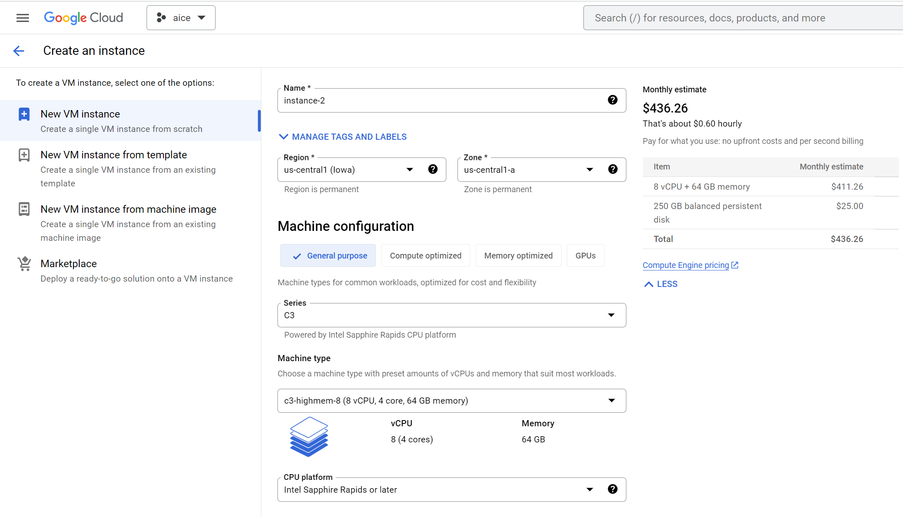
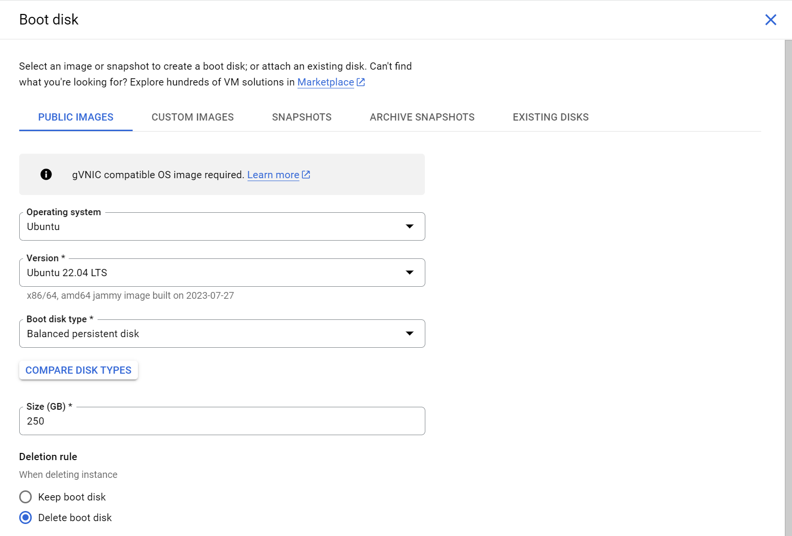
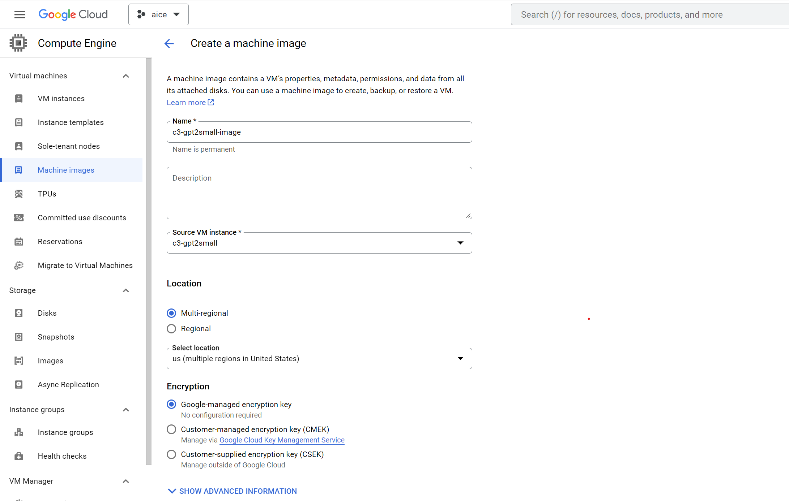
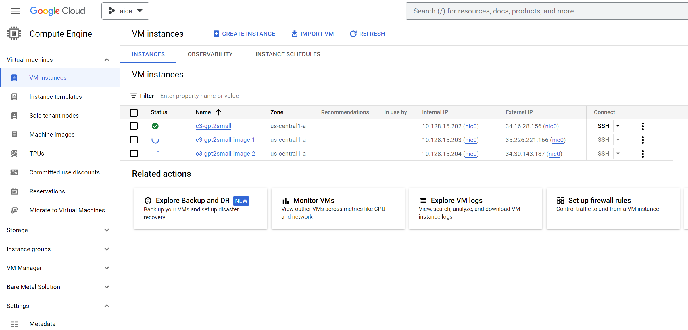
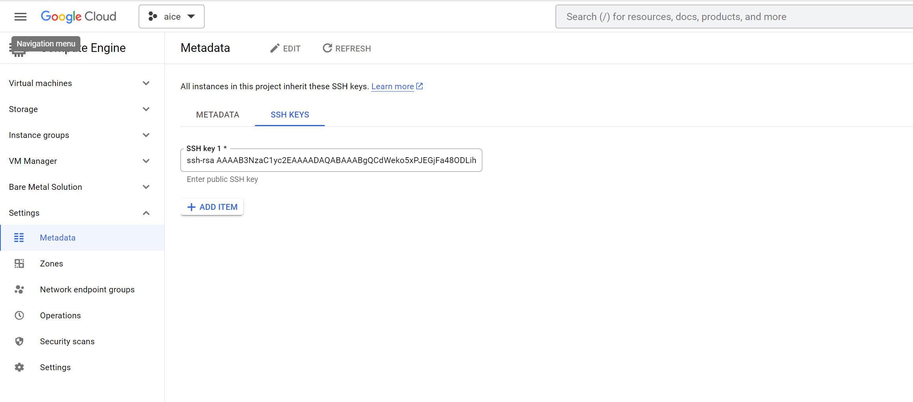
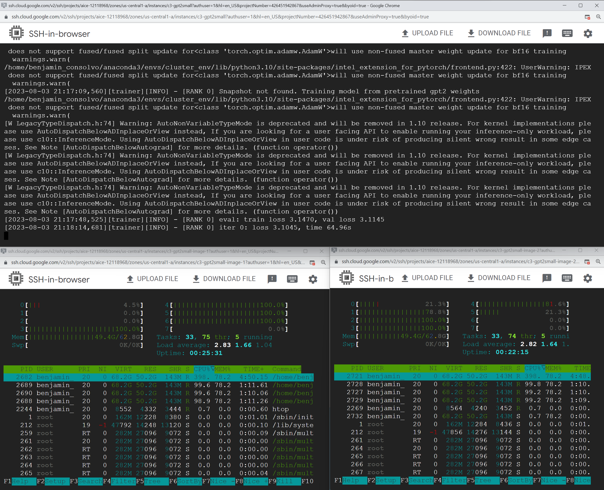

<p align="center">
  
</p>

# Intel® Cloud Optimization Modules for GCP: GPT2-Small Distributed Training

The Intel Cloud Optimization Modules (ICOMs) for GCP are open-source codebases with codified Intel AI software optimizations and instructions built specifically for GCP.  The ICOMs are built with production AI developers in mind, leveraging popular AI frameworks within the context of cloud services.

LLMs (Large Language Models) are becoming ubiquitous, but in many cases, you don't need the full capability of the latest GPT model. Additionally, when you have a specific task at hand, the performance of the biggest GPT model might not be optimal. Often, fine-tuning a small LLM on your dataset is sufficient. In this guide, you will learn how to fine-tune a [GPT2-small](https://huggingface.co/gpt2) (124M parameter) model on a cluster of CPUs on GCP. The objective here is not to arrive at a chatGPT-like AI model, but rather to understand how to set up distributed training so that you can fine-tune to your specific objective. The end result of training here will result in a base LLM that can generate words (or tokens), but it will only be suitable for your use-case when you train it on your specific task and dataset.

The GPT2-small model will be trained on the [OpenWebText](https://huggingface.co/datasets/Skylion007/openwebtext) dataset in a distributed setting, using 3rd or 4th Gen. Intel® Xeon® Scalable Processors. The project builds upon the initial codebase of [nanoGPT](https://github.com/karpathy/nanoGPT), by Andrej Karpathy.


## Table of Contents
- [I. Spinning up an instance with Google Compute Engine]
- [II. OAuth Consent Screen and Credentials]

## I. Spinning up an instance with Google Compute Engine

In order to get the full benefit of the best deep learning training on a CPU as possible, you can spin up 4th Gen Intel® Xeon Scalable Processors, which includes the [Intel® Advanced Matrix Extensions (AMX)](https://www.intel.com/content/www/us/en/products/docs/accelerator-engines/advanced-matrix-extensions/overview.html). On GCP, the 4th Gen Xeon CPU is labeled as "C3" ([see GCP C3 specifications here](https://cloud.google.com/compute/docs/general-purpose-machines#c3_machine_types)). During the distributed training portion, you can spin up 3x "c3-highmem-8" virtual machines, which each have 8 vCPUs (4 physical cores), and 64 GB of memory. 

You can spin up the initial instance from the Google Cloud Console, under "Compute Engine" by selecting the appropriate options, or you can spin up the instance in the Google Cloud Shell with a `gcloud` command. The options I selected in my case are shown in the screenshots here, and the equivalent code is below.



And under the Boot disk option, select "Change" and the following operating system and 250 GB of storage:



Here is the equivalent code for my setup. **Please note that you can't just copy paste this without modification, as it has my specific instance name, project, zone, and service account tied to it.** You can obtain the equivalent code by selecting the options in the screenshots above and then clicking on "Equivalent code" in the top right corner of the Google Console, or replacing the options you need to select with 

```bash
gcloud compute instances create instance-2 \
    --project=aice-12118968 \
    --zone=us-central1-a \
    --machine-type=c3-highmem-8 \
    --network-interface=network-tier=PREMIUM,nic-type=GVNIC,stack-type=IPV4_ONLY,subnet=default \
    --maintenance-policy=MIGRATE \
    --provisioning-model=STANDARD \
    --service-account=426451942867-compute@developer.gserviceaccount.com \
    --scopes=https://www.googleapis.com/auth/devstorage.read_only,https://www.googleapis.com/auth/logging.write,https://www.googleapis.com/auth/monitoring.write,https://www.googleapis.com/auth/servicecontrol,https://www.googleapis.com/auth/service.management.readonly,https://www.googleapis.com/auth/trace.append \
    --min-cpu-platform=Intel\ \
Sapphire\ Rapids \
    --create-disk=auto-delete=yes,boot=yes,device-name=instance-2,image=projects/ubuntu-os-cloud/global/images/ubuntu-2204-jammy-v20230727,mode=rw,size=250,type=projects/aice-12118968/zones/us-central1-a/diskTypes/pd-balanced \
    --no-shielded-secure-boot \
    --shielded-vtpm \
    --shielded-integrity-monitoring \
    --labels=goog-ec-src=vm_add-gcloud \
    --reservation-affinity=any
```

### Environment Setup


Steps:
```bash
sudo apt update
sudo apt install libgoogle-perftools-dev -y

sudo apt-get install python3-pip -y
pip install pip --upgrade
export PATH=/home/ubuntu/.local/bin:$PATH

sudo pip install virtualenv
virtualenv cluster_env
source cluster_env/bin/activate
```

```bash
pip install torch==1.13.0+cpu --extra-index-url https://download.pytorch.org/whl/cpu
python -m pip install intel_extension_for_pytorch==1.13.0
pip3 install oneccl_bind_pt==1.13.0+cpu -f https://developer.intel.com/ipex-whl-stable-cpu

```

```bash
git clone https://github.com/intel/intel-optimizations-aws/
cd distributed-training/nlp/
pip3 install -r requirements.txt
```

Install accelerate
```bash
pip install accelerate
pip install omegaconf
pip install hydra-core --upgrade
```


```
accelerate launch --config_file ./single_config.yaml main.py
```

Your output should look something like:
```bash                                                                     [42/46]
(cluster_env) benjamin_consolvo@c3-gpt2small:~/kubeflow-intel-aws/distributed-training/nlp$ accelerate launch --config_file ./single_config.yaml main.py 
2023-08-03 17:32:54,171 - accelerate.commands.launch - WARNING - The following values were not passed to `accelerate launch` and had defaults used instea
d:                                                                                                                                                       
        `--num_cpu_threads_per_process` was set to `4` to improve out-of-box performance when training on CPUs                                           
To avoid this warning pass in values for each of the problematic parameters or run `accelerate config`.                                                  
Initializing from OpenAI GPT-2 weights: gpt2                                                                                                             
loading weights from pretrained gpt: gpt2                                                                                                                
forcing vocab_size=50257, block_size=1024, bias=True                                                                                                     
overriding dropout rate to 0.0
WARNING: using slow attention. Flash Attention requires PyTorch >= 2.0
WARNING: using slow attention. Flash Attention requires PyTorch >= 2.0                                                                               
WARNING: using slow attention. Flash Attention requires PyTorch >= 2.0                                                                                   
WARNING: using slow attention. Flash Attention requires PyTorch >= 2.0                                                                                   
WARNING: using slow attention. Flash Attention requires PyTorch >= 2.0                                                                                   
WARNING: using slow attention. Flash Attention requires PyTorch >= 2.0                                                                                   
WARNING: using slow attention. Flash Attention requires PyTorch >= 2.0                                                                                   
WARNING: using slow attention. Flash Attention requires PyTorch >= 2.0                                                                                   
WARNING: using slow attention. Flash Attention requires PyTorch >= 2.0                                                                                   
number of parameters: 123.65M                                                                                                                            
num decayed parameter tensors: 50, with 124,318,464 parameters                                                                                           
num non-decayed parameter tensors: 98, with 121,344 parameters                                                                                           
[2023-08-03 17:32:58,644][trainer][INFO] - [RANK 0] Total training samples (tokens/block_size) : 8823811
[2023-08-03 17:32:58,644][trainer][INFO] - [RANK 0] Total validation samples (tokens/block_size) : 4330
[2023-08-03 17:32:58,644][trainer][INFO] - [RANK 0] One epoch (total_training_samples/batch_size): 275744 iterations
[2023-08-03 17:32:58,645][trainer][INFO] - [RANK 0] Snapshot not found. Training model from pretrained gpt2 weights
/home/benjamin_consolvo/anaconda3/envs/cluster_env/lib/python3.10/site-packages/intel_extension_for_pytorch/frontend.py:422: UserWarning: IPEX does not s
upport fused/fused split update for<class 'torch.optim.adamw.AdamW'>will use non-fused master weight update for bf16 training
  warnings.warn(
[W LegacyTypeDispatch.h:74] Warning: AutoNonVariableTypeMode is deprecated and will be removed in 1.10 release. For kernel implementations please use AutoDispatchBelowADInplaceOrView instead, If you are looking for a user facing API to enable running your inference-only workload, please use c10::InferenceMode. Using AutoDispatchBelowADInplaceOrView in user code is under risk of producing silent wrong result in some edge cases. See Note [AutoDispatchBelowAutograd] for more details. (function operator())
[2023-08-03 17:34:06,645][trainer][INFO] - [RANK 0] eval: train loss 3.0947, val loss 3.0770
[2023-08-03 17:34:50,662][trainer][INFO] - [RANK 0] iter 0: loss 3.1103, time 111.79s
[2023-08-03 17:35:32,318][trainer][INFO] - [RANK 0] iter 1: loss 3.1276, time 41.66s
[2023-08-03 17:36:12,764][trainer][INFO] - [RANK 0] iter 2: loss 4.1207, time 40.45s
[2023-08-03 17:36:53,758][trainer][INFO] - [RANK 0] iter 3: loss 4.7583, time 40.99s
[2023-08-03 17:37:34,122][trainer][INFO] - [RANK 0] iter 4: loss 3.8427, time 40.36s
[2023-08-03 17:38:39,139][trainer][INFO] - [RANK 0] eval: train loss 3.6313, val loss 3.4743
[2023-08-03 17:38:41,788][trainer][INFO] - [RANK 0] Snapshot saved at 5 iteration
[2023-08-03 17:39:23,515][trainer][INFO] - [RANK 0] iter 5: loss 3.4503, time 109.39s
[2023-08-03 17:40:04,350][trainer][INFO] - [RANK 0] iter 6: loss 3.4179, time 40.84s
[2023-08-03 17:40:45,510][trainer][INFO] - [RANK 0] iter 7: loss 3.3471, time 41.16s
[2023-08-03 17:41:26,207][trainer][INFO] - [RANK 0] iter 8: loss 3.2343, time 40.70s
[2023-08-03 17:42:06,967][trainer][INFO] - [RANK 0] iter 9: loss 3.1085, time 40.76s
[2023-08-03 17:43:12,290][trainer][INFO] - [RANK 0] eval: train loss 3.1855, val loss 3.1305
[2023-08-03 17:43:25,145][trainer][INFO] - [RANK 0] Snapshot saved at 10 iteration
[2023-08-03 17:44:07,216][trainer][INFO] - [RANK 0] iter 10: loss 3.1472, time 120.25s
[2023-08-03 17:44:47,639][trainer][INFO] - [RANK 0] iter 11: loss 3.1702, time 40.42s
[2023-08-03 17:44:47,639][trainer][INFO] - [RANK 0] Total Samples used for training: 352
Training completed! Total time taken: 00:11:52
```

Distributed Training

How to create machine images documentation from GCP:
https://cloud.google.com/compute/docs/machine-images/create-machine-images

Created a machine image on the console
Show screenshot



Create instances from machine image:

From the Compute Engine window, click "Create Instance" and then you can select "New VM instance from machine image". You can then just press "Create" and it should generate the VM from the image. Do this 1 more time to generate the third instance. Now from the Compute Engine window, you should see your original instance as well as 2 more VMs:


We will set up passwordless SSH so that we can communicate between the master and worker nodes. 

1. run `ssh-keygen` on master instance

2. Follow this and copy over your ~/.ssh/id_rsa.pub file. Add it to Compute Engine - Settings - Metadata - SSH Keys, and hit Save at the bottom left of the screen



https://souvikhaldar.medium.com/how-to-add-the-public-ssh-key-to-a-gcp-virtual-machine-ef5703e8e596

3. On the master node, make a ~/.ssh/config file if it doesn't already exist and input:

```bash
Host 10.*.*.*
   StrictHostKeyChecking no

Host node-1
    HostName 10.128.15.203
    User benjamin_consolvo
    
Host node-2
    HostName 10.128.15.204
    User benjamin_consolvo
```

Also make a ~/hosts file with:
```bash
localhost
node1
```

To run the multi config:
mpirun -f ~/hosts -n 3 -ppn 1 -genv LD_PRELOAD="/usr/lib/x86_64-linux-gnu/libtcmalloc.so" accelerate launch --config_file ./multi_config.yaml --num_cpu_threads_per_process 4 main.py 


Output:
```bash
Initializing from OpenAI GPT-2 weights: gpt2
loading weights from pretrained gpt: gpt2
forcing vocab_size=50257, block_size=1024, bias=True
overriding dropout rate to 0.0
WARNING: using slow attention. Flash Attention requires PyTorch >= 2.0
WARNING: using slow attention. Flash Attention requires PyTorch >= 2.0
WARNING: using slow attention. Flash Attention requires PyTorch >= 2.0
WARNING: using slow attention. Flash Attention requires PyTorch >= 2.0
WARNING: using slow attention. Flash Attention requires PyTorch >= 2.0
WARNING: using slow attention. Flash Attention requires PyTorch >= 2.0
WARNING: using slow attention. Flash Attention requires PyTorch >= 2.0
WARNING: using slow attention. Flash Attention requires PyTorch >= 2.0
WARNING: using slow attention. Flash Attention requires PyTorch >= 2.0
WARNING: using slow attention. Flash Attention requires PyTorch >= 2.0
WARNING: using slow attention. Flash Attention requires PyTorch >= 2.0
WARNING: using slow attention. Flash Attention requires PyTorch >= 2.0
number of parameters: 123.65M
num decayed parameter tensors: 50, with 124,318,464 parameters
num non-decayed parameter tensors: 98, with 121,344 parameters
[2023-08-03 21:07:45,149][torch.distributed.distributed_c10d][INFO] - Added key: store_based_barrier_key:1 to store for rank: 0
Initializing from OpenAI GPT-2 weights: gpt2
loading weights from pretrained gpt: gpt2
forcing vocab_size=50257, block_size=1024, bias=True
overriding dropout rate to 0.0
WARNING: using slow attention. Flash Attention requires PyTorch >= 2.0
WARNING: using slow attention. Flash Attention requires PyTorch >= 2.0
WARNING: using slow attention. Flash Attention requires PyTorch >= 2.0
WARNING: using slow attention. Flash Attention requires PyTorch >= 2.0
WARNING: using slow attention. Flash Attention requires PyTorch >= 2.0
WARNING: using slow attention. Flash Attention requires PyTorch >= 2.0
WARNING: using slow attention. Flash Attention requires PyTorch >= 2.0
WARNING: using slow attention. Flash Attention requires PyTorch >= 2.0
WARNING: using slow attention. Flash Attention requires PyTorch >= 2.0
WARNING: using slow attention. Flash Attention requires PyTorch >= 2.0
WARNING: using slow attention. Flash Attention requires PyTorch >= 2.0
WARNING: using slow attention. Flash Attention requires PyTorch >= 2.0
number of parameters: 123.65M
num decayed parameter tensors: 50, with 124,318,464 parameters
num non-decayed parameter tensors: 98, with 121,344 parameters
[2023-08-03 21:07:45,158][torch.distributed.distributed_c10d][INFO] - Added key: store_based_barrier_key:1 to store for rank: 2
Initializing from OpenAI GPT-2 weights: gpt2
loading weights from pretrained gpt: gpt2
forcing vocab_size=50257, block_size=1024, bias=True
overriding dropout rate to 0.0
WARNING: using slow attention. Flash Attention requires PyTorch >= 2.0
WARNING: using slow attention. Flash Attention requires PyTorch >= 2.0
WARNING: using slow attention. Flash Attention requires PyTorch >= 2.0
WARNING: using slow attention. Flash Attention requires PyTorch >= 2.0
WARNING: using slow attention. Flash Attention requires PyTorch >= 2.0
WARNING: using slow attention. Flash Attention requires PyTorch >= 2.0
WARNING: using slow attention. Flash Attention requires PyTorch >= 2.0
WARNING: using slow attention. Flash Attention requires PyTorch >= 2.0
WARNING: using slow attention. Flash Attention requires PyTorch >= 2.0
WARNING: using slow attention. Flash Attention requires PyTorch >= 2.0
WARNING: using slow attention. Flash Attention requires PyTorch >= 2.0
WARNING: using slow attention. Flash Attention requires PyTorch >= 2.0
number of parameters: 123.65M
num decayed parameter tensors: 50, with 124,318,464 parameters
num non-decayed parameter tensors: 98, with 121,344 parameters
[2023-08-03 21:07:45,158][torch.distributed.distributed_c10d][INFO] - Added key: store_based_barrier_key:1 to store for rank: 1
[2023-08-03 21:07:45,159][torch.distributed.distributed_c10d][INFO] - Rank 2: Completed store-based barrier for key:store_based_barrier_key:1 with 3 nodes.
[2023-08-03 21:07:45,159][torch.distributed.distributed_c10d][INFO] - Rank 1: Completed store-based barrier for key:store_based_barrier_key:1 with 3 nodes.
[2023-08-03 21:07:45,159][torch.distributed.distributed_c10d][INFO] - Rank 0: Completed store-based barrier for key:store_based_barrier_key:1 with 3 nodes.
[2023-08-03 21:07:45,162][trainer][INFO] - [RANK 0] Total training samples (tokens/block_size) : 8823811
[2023-08-03 21:07:45,162][trainer][INFO] - [RANK 0] Total validation samples (tokens/block_size) : 4330
[2023-08-03 21:07:45,162][trainer][INFO] - [RANK 0] One epoch (total_training_samples/batch_size): 275744 iterations
[2023-08-03 21:07:45,163][trainer][INFO] - [RANK 2] Total training samples (tokens/block_size) : 8823811
[2023-08-03 21:07:45,163][trainer][INFO] - [RANK 2] Total validation samples (tokens/block_size) : 4330
[2023-08-03 21:07:45,163][trainer][INFO] - [RANK 2] One epoch (total_training_samples/batch_size): 275744 iterations
[2023-08-03 21:07:45,164][trainer][INFO] - [RANK 0] Snapshot not found. Training model from pretrained gpt2 weights
[2023-08-03 21:07:45,164][trainer][INFO] - [RANK 1] Total training samples (tokens/block_size) : 8823811
[2023-08-03 21:07:45,164][trainer][INFO] - [RANK 1] Total validation samples (tokens/block_size) : 4330
[2023-08-03 21:07:45,164][trainer][INFO] - [RANK 1] One epoch (total_training_samples/batch_size): 275744 iterations
/home/benjamin_consolvo/anaconda3/envs/cluster_env/lib/python3.10/site-packages/intel_extension_for_pytorch/frontend.py:422: UserWarning: IPEX does not support fused/fused split update for<class 'torch.optim.adamw.AdamW'>will use non-fused master weight update for bf16 training
  warnings.warn(
[2023-08-03 21:07:45,166][trainer][INFO] - [RANK 2] Snapshot not found. Training model from pretrained gpt2 weights
[2023-08-03 21:07:45,166][trainer][INFO] - [RANK 1] Snapshot not found. Training model from pretrained gpt2 weights
/home/benjamin_consolvo/anaconda3/envs/cluster_env/lib/python3.10/site-packages/intel_extension_for_pytorch/frontend.py:422: UserWarning: IPEX does not support fused/fused split update for<class 'torch.optim.adamw.AdamW'>will use non-fused master weight update for bf16 training
  warnings.warn(
/home/benjamin_consolvo/anaconda3/envs/cluster_env/lib/python3.10/site-packages/intel_extension_for_pytorch/frontend.py:422: UserWarning: IPEX does not support fused/fused split update for<class 'torch.optim.adamw.AdamW'>will use non-fused master weight update for bf16 training
  warnings.warn(
[W LegacyTypeDispatch.h:74] Warning: AutoNonVariableTypeMode is deprecated and will be removed in 1.10 release. For kernel implementations please use AutoDispatchBelowADInplaceOrView instead, If you are looking for a user facing API to enable running your inference-only workload, please use c10::InferenceMode. Using AutoDispatchBelowADInplaceOrView in user code is under risk of producing silent wrong result in some edge cases. See Note [AutoDispatchBelowAutograd] for more details. (function operator())
[W LegacyTypeDispatch.h:74] Warning: AutoNonVariableTypeMode is deprecated and will be removed in 1.10 release. For kernel implementations please use AutoDispatchBelowADInplaceOrView instead, If you are looking for a user facing API to enable running your inference-only workload, please use c10::InferenceMode. Using AutoDispatchBelowADInplaceOrView in user code is under risk of producing silent wrong result in some edge cases. See Note [AutoDispatchBelowAutograd] for more details. (function operator())
[W LegacyTypeDispatch.h:74] Warning: AutoNonVariableTypeMode is deprecated and will be removed in 1.10 release. For kernel implementations please use AutoDispatchBelowADInplaceOrView instead, If you are looking for a user facing API to enable running your inference-only workload, please use c10::InferenceMode. Using AutoDispatchBelowADInplaceOrView in user code is under risk of producing silent wrong result in some edge cases. See Note [AutoDispatchBelowAutograd] for more details. (function operator())
[2023-08-03 21:08:24,865][trainer][INFO] - [RANK 0] eval: train loss 3.1542, val loss 3.0719
[2023-08-03 21:08:51,264][trainer][INFO] - [RANK 0] iter 0: loss 3.1084, time 65.91s
[2023-08-03 21:09:16,999][trainer][INFO] - [RANK 0] iter 1: loss 3.1076, time 25.73s
[2023-08-03 21:09:41,690][trainer][INFO] - [RANK 0] iter 2: loss 4.0507, time 24.69s
[2023-08-03 21:10:06,411][trainer][INFO] - [RANK 0] iter 3: loss 4.5933, time 24.72s
[2023-08-03 21:10:31,146][trainer][INFO] - [RANK 0] iter 4: loss 3.7046, time 24.73s
[2023-08-03 21:11:06,593][trainer][INFO] - [RANK 0] eval: train loss 3.5070, val loss 3.4650
[2023-08-03 21:11:14,422][trainer][INFO] - [RANK 0] Snapshot saved at 5 iteration
[2023-08-03 21:11:39,256][trainer][INFO] - [RANK 0] iter 5: loss 3.4653, time 68.11s
[2023-08-03 21:12:03,882][trainer][INFO] - [RANK 0] iter 6: loss 3.3724, time 24.63s
[2023-08-03 21:12:28,548][trainer][INFO] - [RANK 0] iter 7: loss 3.3354, time 24.67s
[2023-08-03 21:12:34,927][trainer][INFO] - [RANK 2] Total Samples used for training: 352
Training completed! Total time taken: 00:04:55
[2023-08-03 21:12:39,443][trainer][INFO] - [RANK 1] Total Samples used for training: 352
Training completed! Total time taken: 00:05:00
[2023-08-03 21:12:53,194][trainer][INFO] - [RANK 0] iter 8: loss 3.2272, time 24.65s
[2023-08-03 21:13:17,907][trainer][INFO] - [RANK 0] iter 9: loss 3.1831, time 24.71s
[2023-08-03 21:13:53,184][trainer][INFO] - [RANK 0] eval: train loss 3.2281, val loss 3.2463
[2023-08-03 21:14:06,008][trainer][INFO] - [RANK 0] Snapshot saved at 10 iteration
[2023-08-03 21:14:30,854][trainer][INFO] - [RANK 0] iter 10: loss 3.0916, time 72.95s
[2023-08-03 21:14:55,582][trainer][INFO] - [RANK 0] iter 11: loss 3.2678, time 24.73s
[2023-08-03 21:14:55,583][trainer][INFO] - [RANK 0] Total Samples used for training: 352
Training completed! Total time taken: 00:07:18
```

To look at all of the nodes while they are training, we can SSH into each node and pull up the 3 windows on one screen:




CLEANUP:

- Delete Machine Images
- Terminate Compute Instances


[W socket.cpp:601] [c10d] The client socket has failed to connect to [253.110.170.34.bc.googleusercontent.com]:29500 (errno: 110 - Connection timed out)

-> indicates you may have specified the wrong IP in your multi_config.yaml

