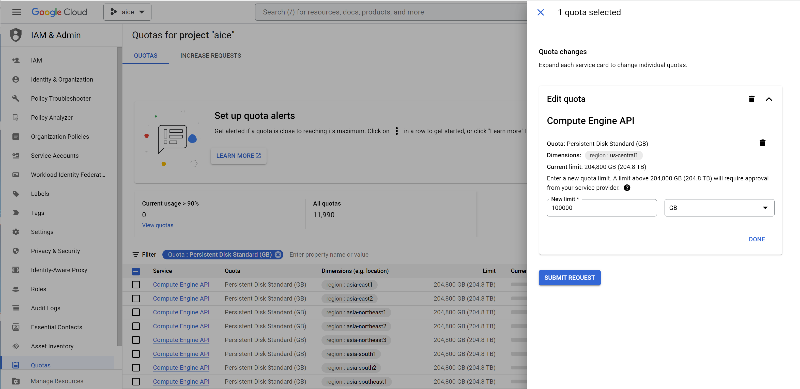
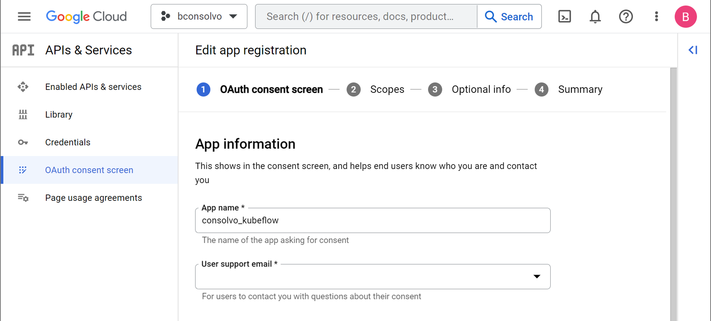
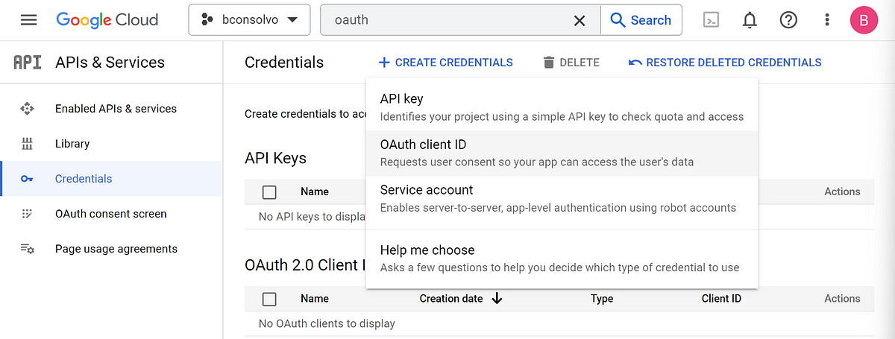
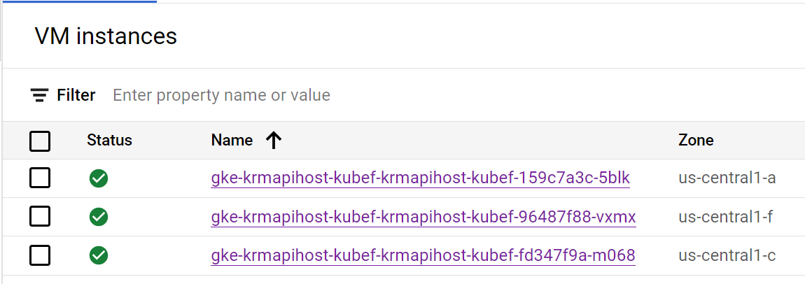
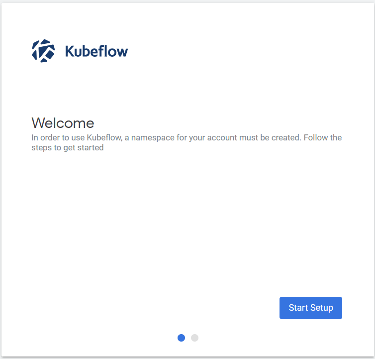

<p align="center">
  
</p>

# Intel® Cloud Optimization Modules for GCP: XGBoost on Kubeflow

This reference solution provides an optimized training and inference architecture of an AI model using XGBoost to predict the probability of a loan default from client characteristics and the type of loan obligation on GCP. This module enables the use of Intel® optimizations for XGBoost and Intel® daal4py in a Kubeflow Pipeline. This guide will walk you through the set up of Kubeflow on GCP, followed by running an Kubeflow pipeline. Note that you can bring and build your own Kubeflow pipelines and that this is just an example to get you started! During the setup of the Kubeflow cluster, we recommend deploying with the latest [C3 CPU available on GCP](https://cloud.google.com/compute/docs/general-purpose-machines#c3_series), which is the 4th Generation Intel Xeon Scalable Processor (code-named Sapphire Rapids) for built-in AI accelerations like [Intel AMX](https://www.intel.com/content/www/us/en/products/docs/accelerator-engines/advanced-matrix-extensions/overview.html).

## Table of Contents

1. [Google APIs and Installing Anthos](#1-google-apis-and-installing-anthos) 
2. [OAuth Consent Screen and Credentials](#2-oauth-consent-screen-and-credentials) 
3. [Deploying Kubeflow Management Cluster](#3-deploying-kubeflow-management-cluster) 
4. [Deploying Kubeflow Cluster](#4-deploying-kubeflow-cluster)
5. [Access the Kubeflow User Interface (UI)](#5-access-the-kubeflow-user-interface-ui)
6. [Running the XGBoost Kubeflow Pipeline](#6-running-the-xgboost-kubeflow-pipeline)
7. [Cleaning Up Kubeflow Resources](#7-cleaning-up-kubeflow-resources)
8. [Next Steps](#8-next-steps)

> **Note**: This guide corresponds to Kubeflow version 1.7.1. The latest GCP Kubeflow can be found [here on GitHub](https://github.com/GoogleCloudPlatform/kubeflow-distribution). 

> **Prerequisites**: It is assumed that you have already created a GCP project and have opened up a Cloud Shell. I've outlined these steps in the [main folder here](../).

## 1. Google APIs and Installing Anthos

 You will need to enable a number of GCP APIs in order to create the necessary clusters. Here is the command you can run in the Cloud Shell to enable the APIs needed for Kubeflow:

```bash
gcloud services enable \
  serviceusage.googleapis.com \
  compute.googleapis.com \
  container.googleapis.com \
  iam.googleapis.com \
  servicemanagement.googleapis.com \
  cloudresourcemanager.googleapis.com \
  ml.googleapis.com \
  iap.googleapis.com \
  sqladmin.googleapis.com \
  meshconfig.googleapis.com \
  krmapihosting.googleapis.com \
  servicecontrol.googleapis.com \
  endpoints.googleapis.com \
  cloudbuild.googleapis.com
```

Anthos Service Mesh is a suite of tools that the official GCP documentation recommends for managing GCP services and environments to make deploying your app easier. In order to use it, you first need to set up its configuration within your GCP project.
If you have not previously ever created a cluster on your GCP project, you will need to temporarily create a cluster and then delete it, before installing Anthos Service Mesh. To do this, you can run the following to create a cluster called "tmp-cluster". This may take a few minutes.

```bash
gcloud beta container clusters create tmp-cluster \
  --release-channel regular \
  --workload-pool=${PROJECT_ID}.svc.id.goog \
  --zone=us-central1
  ```

<details><summary>If at any point in spinning up Compute Engine resources you receive an error like "creation failed: Quota 'SSD_TOTAL_GB' exceeded. Limit: 500.0 in region us-central1", check out the resolution by expanding this collapsed section.</summary>

```bash
Resource exhausted (HTTP 429): Insufficient quota to satisfy the request: Not all instances running in IGM after 39.192176278s. Expected 3, running 1, transitioning 2. Current errors: [GCE_QUOTA_EXCEEDED]: Instance 'gke-tmp-cluster-default-pool-fe2b0b43-lm1d' creation failed: Quota 'SSD_TOTAL_GB' exceeded. Limit: 500.0 in region us-east1.
```
You will need to adjust your Quotas limit on the GCP Console [here](https://console.cloud.google.com/iam-admin/quotas).

You can filter with "Quota: Persistent Disk Standard (GB)", select the appropriate Compute Engine API in the region that you are working in, and then click on "Edit Quota" in the top right. 

</details>

<br>
If you created a temporary cluster, you can then delete the temporary cluster with:

```bash
gcloud beta container clusters delete tmp-cluster --zone=us-central
```

Now, you can run the following to set up the Anthos Service Mesh configuration:
```bash
curl --request POST \
  --header "Authorization: Bearer $(gcloud auth print-access-token)" \
  --data '' \
  https://meshconfig.googleapis.com/v1alpha1/projects/${PROJECT_ID}:initialize
```

where `${PROJECT_ID}` is your GCP Project ID which can be found in the console under [Cloud Overview](https://console.cloud.google.com/home/dashboard).

Upon a successful run, you should just get an output of

```bash
{}
```

If you skipped ever creating a cluster on your account, you may get an error that looks like the following.
```yaml
{
  "error": {
    "code": 400,
    "message": "Identity Pool does not exist (bconsolvo.svc.id.goog). Please check that you specified a valid resource name as returned in the `name` attribute in the configuration API.",
    "status": "INVALID_ARGUMENT"
  }
}
```
If so, go back and create a temporary cluster before trying to set up Anthos Service Mesh.

[Back to Table of Contents](#table-of-contents)

## 2. OAuth Consent Screen and Credentials

You will need to set up a new application under the [OAuth Consent Screen](https://console.cloud.google.com/apis/credentials) and [Credentials](https://console.cloud.google.com/apis/credentials). This is one step that must be completed from the GCP Console, as opposed to the command line. Later on, you will need to use these credentials to create your Kubeflow cluster: `CLIENT_ID` and `CLIENT_SECRET`. First register your app as an External application and in production. You must add your app name as well as your user support email.



Under Authorized domains, enter 
```bash
<PROJECT_ID>.cloud.goog
```
where `<PROJECT_ID>` is your GCP Project ID. And under **Developer contact information**, you need to enter your email under which Google may contact you about potential changes to your project. I just used my same email as I had for the User support email. Now, you can click **SAVE AND CONTINUE**. You can then move through **Scopes and Optional info**, without requiring any more input here. You can then click **BACK TO DASHBOARD**. 

Now that you have created an OAuth application, you can create your credentials.



Under **Application type**, select **Web application**. You can enter any name for your OAuth 2.0 client - it is just used for identification in the console. Go ahead and **CREATE** the credentials. Once created, a popup screen should show your Client ID and Client secret. Go ahead and copy the Client ID to your clipboard. On the Credentials tab, you should now see your created credentials under OAuth 2.0 Client IDs. Go ahead and click on your credentials name to edit it. You will need to add an **Authorized redirect URI**:

```bash
https://iap.googleapis.com/v1/oauth/clientIds/<CLIENT_ID>:handleRedirect
```

where `<CLIENT_ID>` can be pasted in from your clipboard. It should look `xxx.apps.googleusercontent.com`. Click **SAVE**. We will use these credentials later on, just before deploying the Kubeflow cluster.

[Back to Table of Contents](#table-of-contents)

## 3. Deploying Kubeflow Management Cluster

You must first deploy a management cluster before deploying a Kubeflow cluster. Go ahead and open up the Cloud Console to get started. First, you can make sure you have the right tools installed by running:
```bash
sudo apt-get install kubectl google-cloud-sdk-kpt google-cloud-sdk
```

### Clone Kubeflow GCP Distribution from GitHub
You need the Kubeflow GCP distribution from GitHub, which at the time of writing is v1.7.1. We can go ahead and clone it and check out the v1.7.1 tag with:
```bash
git clone https://github.com/googlecloudplatform/kubeflow-distribution.git 
cd kubeflow-distribution
git checkout tags/v1.7.1 -b v1.7.1
```

Navigate to the Kubeflow management folder. For instance, mine is found here:

```bash
cd ~/kubeflow-distribution/management
```
### Save Kubeflow management environment variables
Open env.sh and modify the environment variables. Here is an example of my file:
```bash
export MGMT_PROJECT=bconsolvo
export MGMT_NAME=kubeflow-mgt
export LOCATION=us-central1
```

where the `MGMT_PROJECT` is your GCP Project ID, the `MGMT_NAME` is a new name that you assign to your Kubeflow management cluster, and the `LOCATION` is the server region ([see regions from GCP here](https://cloud.google.com/compute/docs/regions-zones#identifying_a_region_or_zone)). Note that you must include only the region here, but not the specific zone (eg., `us-central1-a` will not work). Now, run

```bash
source env.sh
```
to save these variables in your bash instance. In the same folder, you will need to use kpt to set these values of the management cluster by running
```bash
bash kpt-set.sh
```

You should receive an output like this:
```bash
[RUNNING] "gcr.io/kpt-fn/apply-setters:v0.1"
[PASS] "gcr.io/kpt-fn/apply-setters:v0.1" in 1.9s
  Results:
    [info] data.name: set field value to "kubeflow-mgt"
    [info] data.gcloud.core.project: set field value to "bconsolvo"
    [info] data.location: set field value to "us-central1"
[RUNNING] "gcr.io/kpt-fn/apply-setters:v0.1"
[PASS] "gcr.io/kpt-fn/apply-setters:v0.1" in 400ms
  Results:
    [info] metadata.name: set field value to "kubeflow-mgt"
    [info] spec.location: set field value to "us-central1"
    [info] spec.workloadIdentityConfig.identityNamespace: set field value to "bconsolvo.svc.id.goog"
    [info] namespace: set field value to "bconsolvo"
    [info] metadata.name: set field value to "kubeflow-mgt-pool"
    [info] spec.clusterRef.name: set field value to "kubeflow-mgt"
    [info] metadata.name: set field value to "kubeflow-mgt-cnrm-system"
    [info] metadata.name: set field value to "kubeflow-mgt-cnrm-system-wi"
    [info] spec.resourceRef.name: set field value to "kubeflow-mgt-cnrm-system"
    [info] spec.bindings[0].members[0]: set field value to "serviceAccount:bconsolvo.svc.id.goog[cnrm-system/cnrm-controller-manager]"
    [info] namespace: set field value to "bconsolvo"
    [info] spec.googleServiceAccount: set field value to "kubeflow-mgt-cnrm-system@bconsolvo.iam.gserviceaccount.com"
    [info] namespace: set field value to "bconsolvo"
```

You may be asked to Authorize Cloud Shell - go ahead and authorize with your Google account email. You can always authorize the Cloud Shell at any time by running
```bash
gcloud auth login
```

and following the steps you are prompted to complete on the screen. If the `bash kpt-set.sh` does not run successfully the first time, try it again once you have authorized the Cloud Shell.

Now, we are ready to deploy the Kubeflow management cluster. You can run:
```bash
make create-cluster
```

The `make` is a utility function that looks for a file called `Makefile` in the same directory. We can look at what each call is doing in the `Makefile`. In this instance, we can see that `make create-cluster` is first enabling a few Google APIS, followed by configuring gcloud anthos:
```bash
create-cluster: validate-values
        gcloud services enable krmapihosting.googleapis.com \
                container.googleapis.com \
                cloudresourcemanager.googleapis.com
        gcloud anthos config controller create ${NAME} --location=${LOCATION}
```

The creation of the management cluster may take a few minutes, but you should see an output similar to the following:

```bash
The management cluster name "kubeflow-mgt" is valid.
gcloud services enable krmapihosting.googleapis.com \
        container.googleapis.com \
        cloudresourcemanager.googleapis.com
Operation "operations/acat.p2-426451942867-0c045fc8-5348-4d35-b374-be4a1f15d1db" finished successfully.
gcloud anthos config controller create kubeflow-mgt --location=us-central1
Create request issued for: [kubeflow-mgt]
Waiting for operation [projects/bconsolvo/locations/us-central1/operations/operation-1687986059841-5ff36e17b8f7a-1d051e80-5f0725e6] to complete...done.                                                                                                      
Created instance [kubeflow-mgt].
Fetching cluster endpoint and auth data.
kubeconfig entry generated for krmapihost-kubeflow-mgt
```
You then can create a kubectl context for the management cluster:
```
make create-context
```
Again, by opening up the `Makefile`, you can see what you are running:
```
create-context: validate-values
        # Create a kubeconfig context for the cluster
        PROJECT=$(PROJECT) \
           REGION=$(LOCATION) \
           NAME=$(NAME) $(PACKAGE_DIR)/hack/create_context.sh
```

The output should look like:
```
The management cluster name "kubeflow-mgt" is valid.
# Create a kubeconfig context for the cluster
PROJECT=bconsolvo \
   REGION=us-central1 \
   NAME=kubeflow-mgt /home/benjamin_consolvo/kubeflow-distribution/management/hack/create_context.sh
+ kubectl config delete-context kubeflow-mgt
error: cannot delete context kubeflow-mgt, not in /home/benjamin_consolvo/.kube/config
+ echo 'Context kubeflow-mgt will be created.'
Context kubeflow-mgt will be created.
+ gcloud anthos config controller get-credentials kubeflow-mgt --location=us-central1
Fetching cluster endpoint and auth data.
kubeconfig entry generated for krmapihost-kubeflow-mgt.
++ kubectl config current-context
+ kubectl config rename-context gke_bconsolvo_us-central1_krmapihost-kubeflow-mgt kubeflow-mgt
Context "gke_bconsolvo_us-central1_krmapihost-kubeflow-mgt" renamed to "kubeflow-mgt".
```

### Grant Anthos Config Controller permissions
Now, you must grant the Anthos Config Controller service account the necessary permissions to modify GCP resources:
```bash
make grant-owner-permission
```

The beginning and end of the output should look similar to:
```bash
MGMT_PROJECT=bconsolvo /home/benjamin_consolvo/kubeflow-distribution/management/hack/grant_owner_permission.sh
++ kubectl get ConfigConnectorContext -n config-control -o 'jsonpath={.items[0].spec.googleServiceAccount}'
+ export SA_EMAIL=service-426451942867@gcp-sa-yakima.iam.gserviceaccount.com
+ SA_EMAIL=service-426451942867@gcp-sa-yakima.iam.gserviceaccount.com
+ gcloud projects add-iam-policy-binding bconsolvo 
--member serviceAccount:service-426451942867@gcp-sa-yakima.iam.gserviceaccount.com 
--role roles/owner --project bconsolvo
Updated IAM policy for project [bconsolvo].

...

- members:
  - serviceAccount:service-426451942867@gcp-sa-websecurityscanner.iam.gserviceaccount.com
  role: roles/websecurityscanner.serviceAgent
etag: BwX_N0rmO4E=
version: 1
```

You now should have your management cluster up and running, and we can go ahead and deploy the Kubeflow cluster. By clicking into the GCP Console top-left hamburger menu, and selecting Compute Engine, you should see 3 VM instances running on the GCP console, corresponding to the Kubeflow management cluster.



If we click on one of these VM instances, you should see that each is a [e2-standard-2 machine](https://cloud.google.com/compute/docs/general-purpose-machines#e2_machine_types_table), which are Intel VMs with 2 vCPUs and 8 GB of memory. The management cluster does not require significant compute.

[Back to Table of Contents](#table-of-contents)

## 4. Deploying Kubeflow Cluster

After deploying the Kubeflow management cluster, the next step is to deploy the Kubeflow cluster itself. At this point in the workflow, you should already have: set up and installed Anthos, set up your OAuth credentials, saved `$MGMT_PROJECT`, `$MGMT_NAME`, and `$LOCATION` environment variables and ran `bash kpt-set.sh` in the `~/kubeflow-distribution/management` folder, created the Kubeflow management cluster, and granted Anthos Config Controller service account the permissions to modify GCP resources.

Now, you need to navigate to the `kubeflow` folder and pull manifests from the `kubeflow/manifests` repository:

```bash
cd ~/kubeflow-distribution/kubeflow
bash ./pull-upstream.sh
```
The beginning and end of the output should look something like:
```bash
+ export KUBEFLOW_MANIFESTS_VERSION=v1.7.0
+ KUBEFLOW_MANIFESTS_VERSION=v1.7.0
+ export KUBEFLOW_MANIFESTS_REPO=https://github.com/kubeflow/manifests.git
+ KUBEFLOW_MANIFESTS_REPO=https://github.com/kubeflow/manifests.git
+ export KUBEFLOW_PIPELINES_VERSION=2.0.0-alpha.7
+ KUBEFLOW_PIPELINES_VERSION=2.0.0-alpha.7
+ export KUBEFLOW_PIPELINES_REPO=https://github.com/kubeflow/pipelines.git
+ KUBEFLOW_PIPELINES_REPO=https://github.com/kubeflow/pipelines.git

...

Fetched 1 package(s).
+ rm contrib/kserve/models-web-app/upstream/Kptfile
+ '[' -d contrib/kserve/kserve/upstream ']'
+ mkdir -p contrib/kserve/kserve
+ kpt pkg get https://github.com/kubeflow/manifests.git/contrib/kserve/kserve/@v1.7.1 contrib/kserve/kserve/upstream/
Package "upstream":
Fetching https://github.com/kubeflow/manifests@v1.7.0
From https://github.com/kubeflow/manifests
 * tag               v1.7.0     -> FETCH_HEAD
Adding package "contrib/kserve/kserve".

Fetched 1 package(s).
+ rm contrib/kserve/kserve/upstream/Kptfile
```


Now we will need to set a few more environment variables in
```bash
~/kubeflow-distribution/kubeflow/
```
You can follow the instructions in the `env.sh` file to fill in the correct information for `$KF_PROJECT`, `$KF_PROJECT_NUMBER`, `$ADMIN_EMAIL`, and `$MGMT_NAME`. Save the env.sh file and run
```bash
source env.sh
```

At this point, you will also need to set your credentials as environment variables that you during the OAuth Credentials step:
```bash
export CLIENT_ID=<CLIENT_ID>
export CLIENT_SECRET=<CLIENT_SECRET>
```
You can now run the following command to fingure kpt for your Kubeflow cluster:
```bash
bash ./kpt-set.sh
```
The beginning and end of the output should look like:
```bash
+ [[ -z kubeflow ]]
+ [[ -z kubeflow-mgt ]]
+ [[ -z bconsolvo ]]

...

katib-metricscollector-injection: 'enabled'
katib.kubeflow.org/metrics-collector-injection: 'enabled'
serving.kubeflow.org/inferenceservice: 'enabled'
pipelines.kubeflow.org/enabled: 'true'
app.kubernetes.io/part-of: 'kubeflow-profile'
# Below is a list of labels to be enforced.
istio-injection: ''
istio.io/rev: asm-1162-2 # kpt-set: ${asm-label}
```

You can now create a `kubectl` namespace, connecting the Kubeflow project to the management cluster:
```bash
make apply-kcc
```

If you look at the `Makefile`, you can see what apply-kcc is really doing:

```bash
apply-kcc: validate-kcc-values
        kubectl create namespace ${KF_PROJECT} --dry-run=client -o yaml | kubectl --context=$(MGMTCTXT) apply -f -
        ./kcc/kpt-set.sh
        kubectl --context=$(MGMTCTXT) apply -f ./kcc/kcc-namespace
```

The output should look similar to:
```bash
kubectl create namespace bconsolvo --dry-run=client -o yaml | kubectl --context=kubeflow-mgt apply -f -
namespace/bconsolvo created
./kcc/kpt-set.sh
[RUNNING] "gcr.io/kpt-fn/apply-setters:v0.1"
[PASS] "gcr.io/kpt-fn/apply-setters:v0.1" in 300ms
  Results:
    [info] metadata.name: set field value to "cnrm-network-viewer-bconsolvo"
    [info] metadata.namespace: set field value to "config-control"
    [info] subjects[0].name: set field value to "cnrm-controller-manager-bconsolvo"
    [info] metadata.name: set field value to "cnrm-project-viewer-bconsolvo"
    ...(19 line(s) truncated, use '--truncate-output=false' to disable)
kubectl --context=kubeflow-mgt apply -f ./kcc/kcc-namespace
rolebinding.rbac.authorization.k8s.io/cnrm-network-viewer-bconsolvo created
rolebinding.rbac.authorization.k8s.io/cnrm-project-viewer-bconsolvo created
iampartialpolicy.iam.cnrm.cloud.google.com/kcc-bconsolvo-owners-permissions created
configconnectorcontext.core.cnrm.cloud.google.com/configconnectorcontext.core.cnrm.cloud.google.com created
iamserviceaccount.iam.cnrm.cloud.google.com/kcc-bconsolvo created
iampartialpolicy.iam.cnrm.cloud.google.com/bconsolvo-sa-workload-identity-binding created
namespace/bconsolvo configured
```

### Correcting YAML files before deploying Kubeflow cluster

In the Kubeflow distribution v1.7.0, there were a couple of files that were causing errors in the deployment, complaining about the inclusion of `metadata.ClusterName` in the following YAML files:

```bash
~/kubeflow-distribution/kubeflow/common/cluster/upstream/cluster.yaml
~/kubeflow-distribution/kubeflow/common/cluster/upstream/nodepool.yaml
```

However, the GCP Kubeflow GitHub has merged my pull requests now, and these should no longer be a problem. Here are the pull requests with the code changes:

1. [Remove clusterName from nodepool.yaml](https://github.com/GoogleCloudPlatform/kubeflow-distribution/pull/427/commits/876b57537de3927d28d35a4edda587a04176b0f3)
2. [Remove metadata.ClusterName entirely from cluster.yaml](https://github.com/GoogleCloudPlatform/kubeflow-distribution/pull/426/commits/42c1597b0e809a13057df83b6a4a8f042c382521)

There is still one more YAML file that needs to have a line removed to avoid one more error. The file can be found here:
```bash
~/kubeflow-distribution/kubeflow/apps/profiles/upstream/crd/bases/kubeflow.org_profiles.yaml
```

The line that needs to be removed is:
```bash
creationTimestamp: null
```

If this is not removed, you will receive an error like the following:
```bash
...
error: unable to decode "apps/profiles/build/apiextensions.k8s.io_v1_customresourcedefinition_profiles.kubeflow.org.yaml": parsing time "null" as "2006-01-02T15:04:05Z07:00": cannot parse "null" as "2006"
make: *** [Makefile:83: apply] Error 1
```

The issue was raised on GitHub [here](https://github.com/kubeflow/kubeflow/issues/7041#issuecomment-1493434289).

### Deploying the Kubeflow Cluster on C3 Machine Shape

By default, the Kubeflow cluster spins up 2x `e2-standard-8` instances. To deploy your Kubeflow cluster onto the latest C3 machine shape (4th Gen. Xeon CPU), you can modify the last couple of lines of the `cluster-patch.yaml` file that can be found here:

```bash
~/kubeflow-distribution/kubeflow/common/cnrm/cluster-patch.yaml
```

to specify a custom [`c3-highcpu-4` machine shape](https://cloud.google.com/compute/docs/general-purpose-machines#c3-highcpu). To learn more about the 4th Gen. Intel Xeon CPUs on GCP (C3 machine type), you can read more from [Google's blog here](https://cloud.google.com/blog/products/compute/introducing-c3-machines-with-googles-custom-intel-ipu). Uncomment the last two lines and specify the machine type as follows:

```yaml
spec:
  location: LOCATION # kpt-set: ${location}
  # Add any fields here to override default cluster spec
  # Refer to https://cloud.google.com/config-connector/docs/reference/resource-docs/container/containercluster
  # for detailed fields and documentation.
  nodeConfig:
   machineType: c3-highcpu-4
```

You should now be ready to deploy the Kubeflow cluster. Make sure you are in

```bash
~/kubeflow-distribution/kubeflow/
```
and run
```
make apply
```

The process to deploy the Kubeflow cluster may take 20 minutes or so. In some cases, I get timeout errors like the following:

```bash
kubectl --context=kubeflow apply -f ././build/*v1_customresourcedefinition_podautoscalers.autoscaling.internal.knative.dev.yaml
Unable to connect to the server: net/http: request canceled (Client.Timeout exceeded while awaiting headers)
make[1]: *** [Makefile:27: apply] Error 1
make[1]: Leaving directory '/home/benjamin_consolvo/kubeflow-distribution/kubeflow/common/knative'
make: *** [Makefile:83: apply] Error 1
```
I have outlined other errors [here on the GCP Kubeflow GitHub issues page](https://github.com/GoogleCloudPlatform/kubeflow-distribution/issues/434),  but my current solution to facing most errors at this stage was to just **rerun** `make apply`. Upon successful completion of deploying the Kubeflow cluster, the end of the output should look like:
```bash
...
partitioned roll out complete: 1 new pods have been updated...
sleep 90
# Kick the IAP pod because we will reset the policy and need to patch it.
# TODO(https://github.com/kubeflow/gcp-blueprints/issues/14)
kubectl --context=kubeflow -n istio-system delete deployment iap-enabler
deployment.apps "iap-enabler" deleted
# Kick the backend updater pod, because information might be outdated after the apply.
# https://github.com/kubeflow/gcp-blueprints/issues/160
kubectl --context=kubeflow -n istio-system delete statefulset backend-updater
statefulset.apps "backend-updater" deleted
# Kick the cloud-endpoints-enabler deployment
kubectl --context=kubeflow -n istio-system delete deployment cloud-endpoints-enabler
deployment.apps "cloud-endpoints-enabler" deleted
make[1]: Leaving directory '/home/benjamin_consolvo/kubeflow-distribution/kubeflow/common/iap-ingress'
```

To check the deployment, you first need to set your `kubectl` credentials to point to the new cluster:

```bash
gcloud container clusters get-credentials "${KF_NAME}" --zone "${ZONE}" --project "${KF_PROJECT}"
```

And you should get an output like:
```bash
Fetching cluster endpoint and auth data.
kubeconfig entry generated for kubeflow.
```
Then, to check the `kubeflow` namespace of your cluster, you can run:
```bash
kubectl -n kubeflow get all
```

which should result in an output similar to:
```bash
...

replicaset.apps/volumes-web-app-deployment-784dff66cd              1         1         1       19m
replicaset.apps/workflow-controller-7b8c6489c                      1         1         1       18m

NAME                              READY   AGE
statefulset.apps/metacontroller   1/1     20m
```
If you look at the Compute Engine section of the GCP Console, you should find 2x C3 machines that have been spun up for the Kubeflow cluster.

[Back to Table of Contents](#table-of-contents)

## 5. Access the Kubeflow User Interface (UI)

To access the newly deployed Kubeflow interface, you can run the following command to add the IAP-secured Web App User role to your IAM role for your email account.
```bash
gcloud projects add-iam-policy-binding "${KF_PROJECT}" --member=user:<EMAIL> --role=roles/iap.httpsResourceAccessor
```
where `$KF_PROJECT` should be your GCP PROJECT_ID and `<EMAIL>` should be your email you specified in the OAuth setup. The end of the output should look similar to:

```bash
...

  - serviceAccount:kubeflow-user@bconsolvo.iam.gserviceaccount.com
  role: roles/viewer
- members:
  - serviceAccount:service-426451942867@gcp-sa-websecurityscanner.iam.gserviceaccount.com
  role: roles/websecurityscanner.serviceAgent
etag: BwX_54jINg0=
version: 1
```

To check the URL of your Kubeflow deployment, you can run:
```bash
kubectl -n istio-system get ingress
```

The output should give you the URL under `HOSTS` as follows:
```bash
NAME            CLASS    HOSTS                                         ADDRESS          PORTS   AGE
envoy-ingress   <none>   kubeflow.endpoints.bconsolvo.cloud.goog   34.160.122.202   80      21m
```

I now can visit https://kubeflow.endpoints.bconsolvo.cloud.goog in my web browser and access Kubeflow!



[Back to Table of Contents](#table-of-contents)

## 6. Running the XGBoost Kubeflow Pipeline

### Create the Pipeline .YAML file

To generate the .YAML pipeline file, you can git clone this repository with:

```bash
git clone https://github.com/intel/intel-cloud-optimizations-gcp.git
cd kubeflow/pipelines
```

Install the Python package `kfp` in order to generate the pipeline from [pipelines/intel-xgboost-daal4py-pipeline.py](pipelines/intel-xgboost-daal4py-pipeline.py):
```bash
pip install kfp==2.0.1
```

And then you can generate the `intel-xgboost-daal4py-pipeline.yaml` file with:
```bash
python3 intel-xgboost-daal4py-pipeline.py
```

### Log into the Kubeflow UI

You should be able to log into your Kubeflow UI on your web browser with the URL we generated in the previous step. The URL should look similar to https://kubeflow.endpoints.bconsolvo.cloud.goog. 

### Upload and Run the Pipeline

1.  Once you have logged into Kubeflow, click on the Pipelines tab from the sidebar 
    menu.
2.  Click on the Upload Pipeline button in the top right and type in a new name and 
    description for the Pipeline.
3.  Select Upload a file and navigate to the directory where the 
    `intel-xgboost-daal4py-pipeline.yaml` is located. Click Create.
4.  You should be redirected to a graph overview of the pipeline. In the top right,
    select Create run.
5.  In the Run parameters section at the bottom, you can review and update the default 
    values of the pipeline parameters.
6.  Click Start to begin running the pipeline.  
7.  When the Pipeline is finished running, check out the **Visualizations** tab for 
    the `Daal4py Inference` and `Plot ROC Curve` steps to view the model metrics.

[Back to Table of Contents](#table-of-contents)
## 7. Cleaning Up Kubeflow Resources

In order to clean up Kubeflow resources, we need to first delete the Kubeflow cluster, and then the Kubeflow management cluster. Starting with the Kubeflow cluster, you first need to delete the applications running in the Kubeflow namespace with:

```bash
kubectl delete namespace kubeflow
```

Then, you can delete the cluster and Google Cloud resources after navigating to

```bash
cd ~/kubeflow-distribution/kubeflow/
```

by running

```bash
make delete
```

and type `y` and hit enter. This may take a few minutes to complete. The beginning and end of the output should look like:

```bash
# Delete gcp resources except managed storage
BUILD_DIR=./build MGMTCTXT=kubeflow-mgt ./hack/delete_gcp.sh
Deleting all Google Cloud resources including your GKE cluster and data in the cluster, except the Cloud SQL instance and GCS bucket. Confirm? [y/N] y
computeaddress.compute.cnrm.cloud.google.com "kubeflow-ip" deleted
containercluster.container.cnrm.cloud.google.com "kubeflow" deleted

...

service.serviceusage.cnrm.cloud.google.com "meshtelemetry.googleapis.com" deleted
service.serviceusage.cnrm.cloud.google.com "monitoring.googleapis.com" deleted
service.serviceusage.cnrm.cloud.google.com "servicemanagement.googleapis.com" deleted
```

In order to clean up the management cluster, you can run:
```bash
kubectl config use-context "${MGMTCTXT}"
kubectl delete namespace --wait "${KF_PROJECT}"
```

and then after navigating to
```bash
cd ~/kubeflow-distribution/management/
```

run
```bash
make delete-cluster
```

This may take 5–10 minutes to complete. Both your Kubeflow cluster and your Kubeflow management cluster should now be deleted, and you should not continue to receive bills for these instances.

Thank you for reading!
[Back to Table of Contents](#table-of-contents)

## 8. Next Steps
1. [Register for Office Hours here](https://software.seek.intel.com/SupportFromIntelExperts-Reg) to get help on your implementation.

2. Learn more about all of our [Intel Cloud Optimization Modules here](https://www.intel.com/content/www/us/en/developer/topic-technology/cloud-optimization.html).

3. Come chat with us on our [DevHub Discord](https://discord.gg/rv2Gp55UJQ) server to keep interacting with fellow developers.

4. Stay connected with me on social media: Benjamin Consolvo, AI Community Enablement Manager | [LinkedIn](https://linkedin.com/in/bconsolvo) | [Twitter](https://twitter.com/bpconsolvo )

[Back to Table of Contents](#table-of-contents)